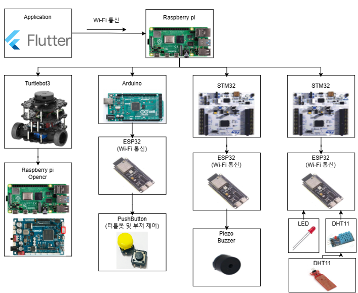

<<<<<<< HEAD
# -Intel-6--MOMS-cookie
=======
# MOMS Cookie: 현대인의 바쁜 일상을 완벽하게 해주는 엄마같은 비서

  
더이상의 5분만은 없다

---

## 📚 목차

- [📌 프로젝트 개요](#-프로젝트-개요)
- [🔧 주요 기능](#-주요-기능)
- [🖥️ 시스템 구조도](#-시스템-구조도)
- [👤 담당 역할](#-담당-역할)
- [🎬 시연 영상](#-시연-영상)
- [🛠️ 사용 기술들](#-사용-기술들)
- [👥 개발자](#-개발자)

---

## 📌 프로젝트 개요

MOMS Cookie (Management Of Morning – Secretary : Cookie)는 바쁜 아침을 효율적으로 시작할 수 있도록 설계된 **대화형 스마트 비서 로봇 시스템**입니다.  
침실에서 울리는 알람과 함께, 로봇은 자동으로 이동을 시작하고 사용자는 이를 따라 움직이며 자연스럽게 하루를 시작하게 됩니다.  
이후에는 로봇에게 말을 걸어 오늘의 일정, 날씨, 미세먼지를 음성으로 안내받을 수 있습니다.

> 🤖 ChatGPT 기반 응답 시스템과 Flutter 앱, IoT 장치를 연동하여  
> 스마트폰 조작, 음성 상호작용, 위치 제어까지 모두 통합된 홈 어시스턴트를 구현했습니다.

---

## 🔧 주요 기능

- 사용자의 음성을 인식하고 정보를 스피커로 출력하는 대화형 인터페이스  
- Open API를 활용해 날씨·미세먼지 정보를 수집 및 안내  
- GPT-4 Turbo 기반 ChatGPT 응답 시스템으로 스마트 비서 기능 제공  
- Flutter 앱을 통한 일정 관리 및 텍스트 기반 일정 요청 처리  
- IoT 연동으로 조명, 보일러, 가습기 등 환경 제어 가능  
- 터틀봇에 버튼 또는 앱으로 명령해 원하는 장소로 이동시키는 호출 기능

---

## 🖥️ 시스템 구조도

본 구성도는 MOMS Cookie 시스템에서 사용된 실제 하드웨어 사진과 각 장치 간의 통신 흐름을 포함하여 시각화한 자료입니다.

---

## 👤 담당 역할

- **TurtleBot3의 SLAM 및 네비게이션 설정**을 통해 목적지 이동 기능 구현  
- **STM32에 연결된 온습도 및 수위 센서** 기반으로  
  가습기 조건 제어 및 알람 발생 시 조명·보일러 자동 작동 로직 구성  
- **Arduino Mega 버튼 입력**을 통한 위치 이동 명령 생성 및 서버 연동 처리  
- **ESP32를 이용해 STM32와 Arduino Mega 간** Wi-Fi 기반 통신 구조 설계 및 명령 송수신 처리

---

## 🎬 시연 영상 모음

### 🏠 집 모형 시연  
  
✔ 알람이 울리면 자동으로 안방 불(초록 LED)과 보일러(빨간 LED)가 켜지며 기상 준비를 유도합니다.  
✔ 온습도 및 수위 센서를 통해 조건이 충족되면 가습기(노란 LED)도 자동으로 작동합니다.

---

### 🗣️ 음성 비서 대화  
  
✔ 날씨/미세먼지 정보를 API로 수집하고, 등록된 일정을 ChatGPT에게 전달하여 TTS로 음성 안내를 제공합니다.  
✔ 사용자가 챗봇처럼 자유롭게 질문하면, 대답 역시 TTS로 응답됩니다.

---

### 🤖 비서 자동 이동  
  
✔ 알람이 울리면 침실에서 부엌으로 자동 이동하여 사용자의 아침 루틴을 자연스럽게 유도합니다.  
✔ 이후 앱, 음성 명령, 버튼을 통해 원하는 위치로 비서를 자유롭게 이동시킬 수 있습니다.

---

### 🗓️ 일정 등록 기능  
  
✔ Flutter 앱을 통해 일정과 알람을 직접 등록할 수 있으며, 해당 정보는 음성 안내 및 이동 루틴에 반영됩니다.  
✔ 영상에서는 일정 등록 UI와 동작 과정이 시연됩니다.

---

## 🛠️ 사용 기술들

✅ 프로그래밍 언어

  

✅ 임베디드 & 하드웨어

   

✅ 플랫폼 & 프레임워크

   

✅ 빌드 & 개발 환경

---

## 👥 개발자

|권태형|이종범|임소연|김병성|
|:------:|:------:|:------:|:------:|
|  |  |  |  |

---
>>>>>>> 00d4b6c (Project_MOMS_Cookie)
